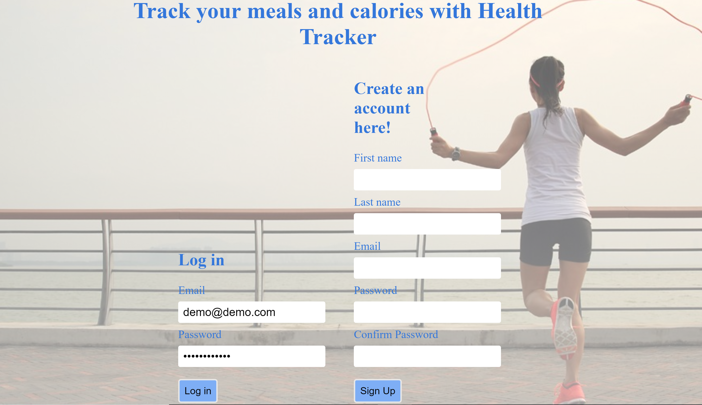

<h1>Health Tracker</h2>
<h3>Live app here: https://dashboard.heroku.com/apps/warm-bayou-57425</h3> 

They say the key to success if preparation and goal setting. 
So this app is meant to help you keep track of your weight loss journey.
Add your weight, caloric intake and calories burned for the day. You can also add the foods you've been eating to take into with your progress.
So each time you log in and add a new day to record your values for that specific day, you'll have an idea if what you're doing is giving you results or if you should make some adjustments.
There is demo with a fake email and password already displayed so just click login to give it a try.

<h2>Technical Stack</h2>
<h3>Front end</h3>
<ul>
<li>HTML</li>
<li>CSS
<ul><li>Responsive grid design for mobile screens and tablets, as well.</li></ul>
</li>
<li>JavaScript</li>
<li>jQuery</li>
</ul>
<h3>Back end</h3>
<ul>
<li>Node.js</li>
<li>Express.js</li>
<li>MongoDB</li>
<li>Mongoose</li>
<li>Mlab</li>
<li>Mocha and Chai</li>
</ul>

Login page

Homepage

Add progress

Progress page

